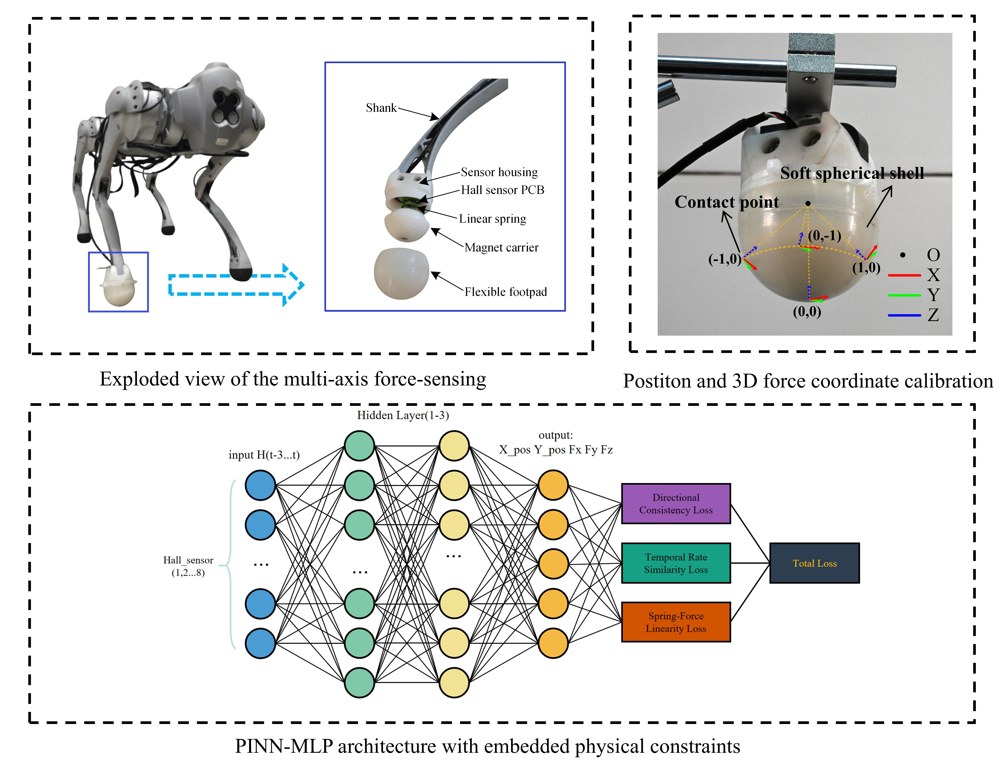
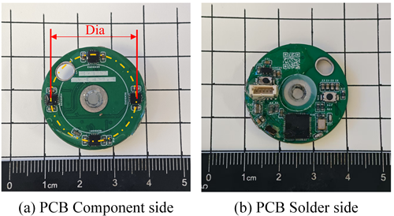
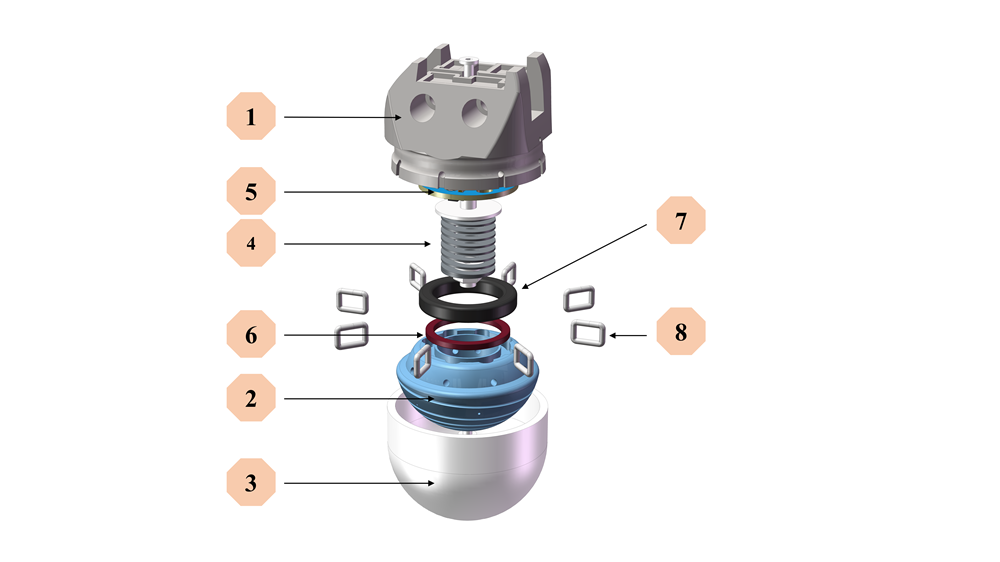

# Catch-Contact-the-Force
A Multi-Contact-Point, Multi-Axis Foot-End Force Sensor for Legged Robots Magnetic-Hall Sensing via Spring Deformation

<p align = "center">

</p>

## How to use:
I sincerely hope that my project can be widely known and that everyone can use the CtF foot-end sensor for their quadruped robots. However, the 200k-sample dataset is too large to be uploaded to GitHub.
If you need the dataset, please contact me at: 936915881mxlzy@gmail.com
 to request access.

Inference only
If you only want to run inference, everything becomes simple. Just set up the required environment and run:

```python evaluate.py or python3 evaluate.py```


This will generate the corresponding prediction tables and plots in the current directory.

Real-time inference with the CtF foot-end sensor
If you are lucky enough to own a CtF multi-axis foot-end sensor, simply plug it into your personal PC via a USB 2.0 port, and run:

```python serial_inference.py --port COMxxx --baud 115200 --print-hz 25 --csv pred.csv```


This will display real-time predictions of contact point and contact force in the terminal, while saving results to pred.csv.

Training
If you intend to perform training, please note this is a major undertaking. You will need at least a commercial 3D force sensor or a robotic arm equipped with a 3D force sensor, and you must collect large amounts of real-time data for calibration and learning.

##PCB
<p align = "center">

</p>

##Structure
<p align = "center">

</p>

## License
Code is licensed under the **PolyForm Noncommercial License 1.0.0**.
Noncommercial use only; commercial use requires a separate license from the author.

## Attribution
Please retain the copyright notice and cite:

Meng, X., Lu, J., Ma, W. (2025). CtF: Multi-Contact, Multi-Axis Foot-End Force Estimation (PINN+MLP).

See `CITATION.cff` for a citation entry.
