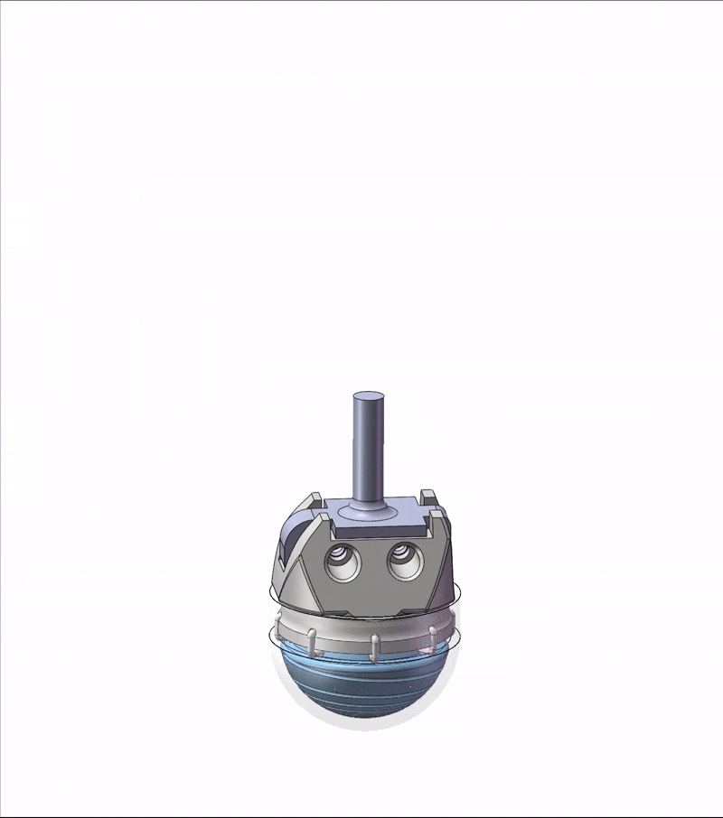

# Catch-Contact-the-Force
A Multi-Contact-Point, Multi-Axis Foot-End Force Sensor for Legged Robots Magnetic-Hall Sensing via Spring Deformation

## Show：

## License
Code is licensed under the **PolyForm Noncommercial License 1.0.0**.
Noncommercial use only; commercial use requires a separate license from the author.

## Attribution
Please retain the copyright notice and cite:

Meng, X., Lu, J., Ma, W. (2025). CtF: Multi-Contact, Multi-Axis Foot-End Force Estimation (PINN+MLP).

See `CITATION.cff` for a citation entry.
